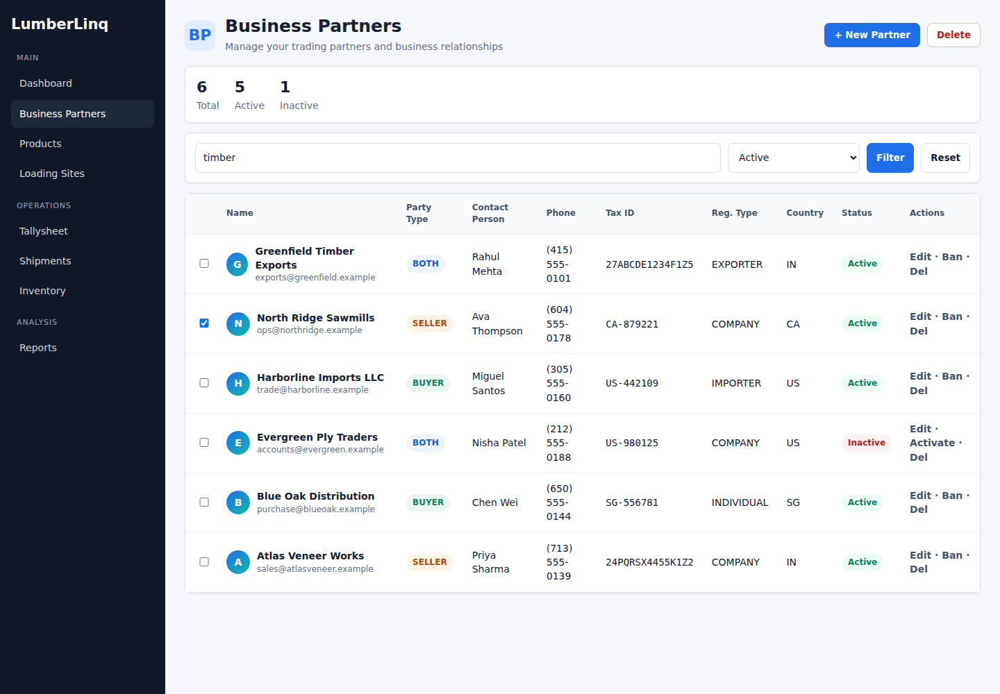
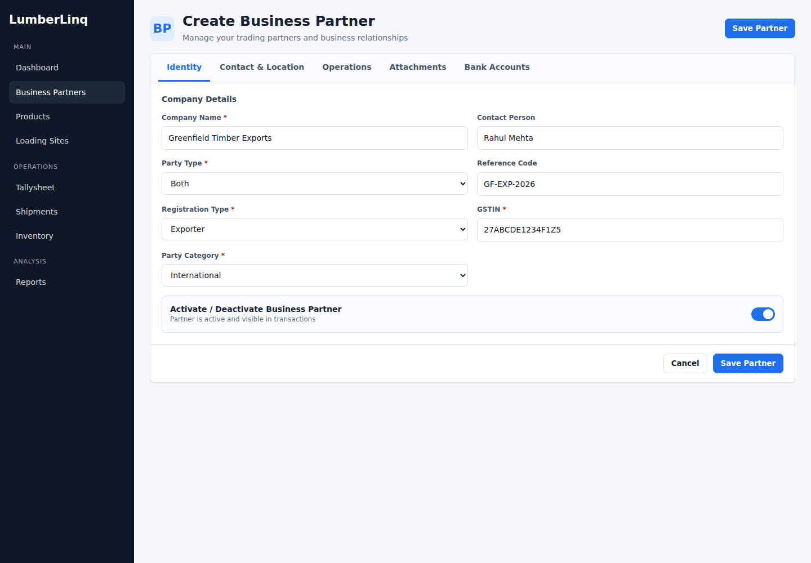
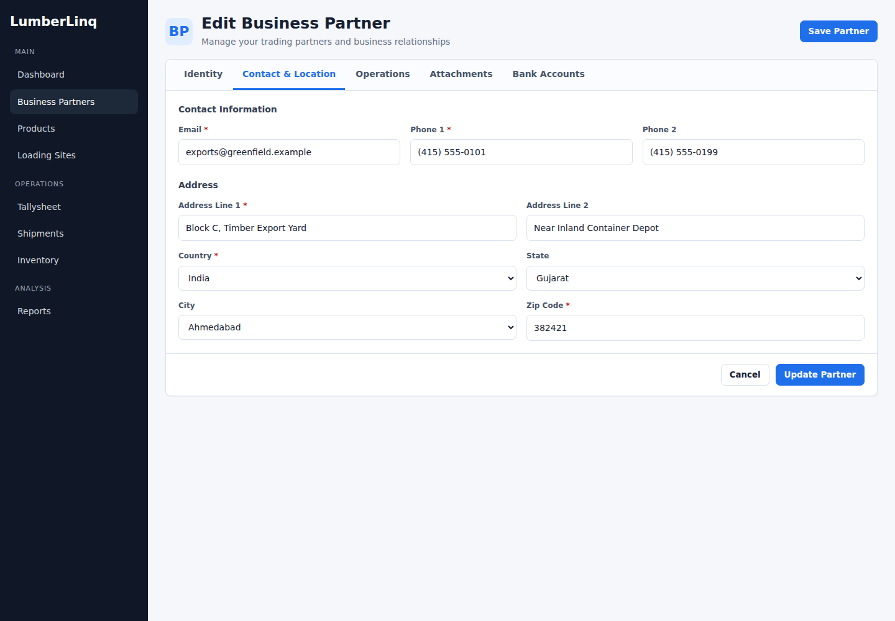
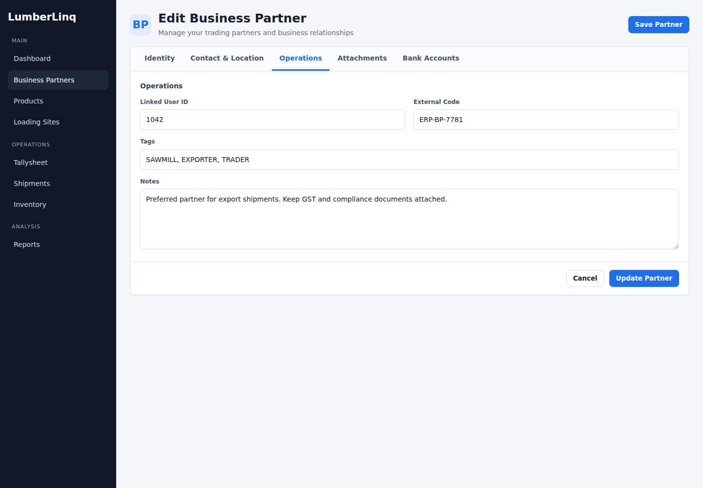
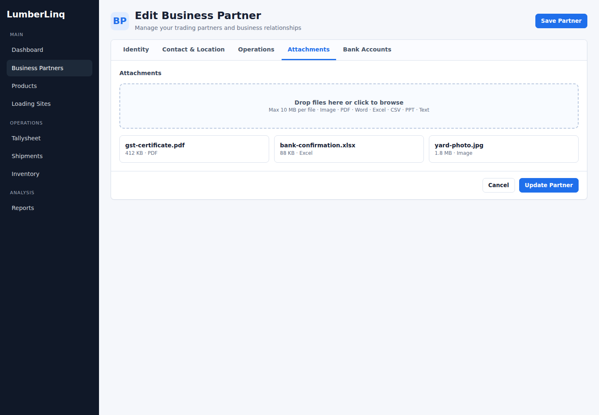
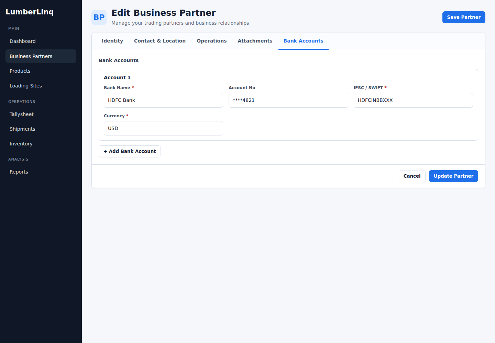
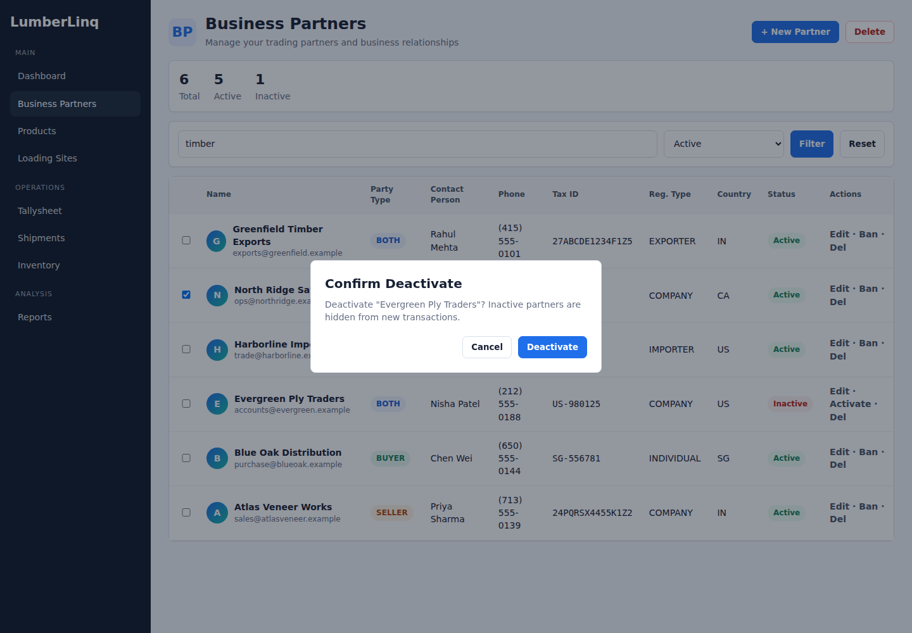

# Business Partners User Manual

Business Partners stores the companies and contacts your organization trades with in LumberLinq. A partner can be a buyer, seller, exporter, importer, or both buyer and seller.

Business Partner records are used in shipments, tallysheets, inventory movements, documents, and reports.

## Open Business Partners

Go to **Business Partners > View Business Partners**.

The list shows each partner's name, party type, contact person, phone number, tax ID, registration type, country, and active status.

## Search and Filter Partners

Use the search box to find partners by name, email, contact person, or tax ID.

Use the status filter to show active partners, inactive partners, or all partners.

You can also sort table columns and use column filters for fields such as name, contact person, phone, and tax ID.

## Add a Business Partner

Click **New Partner**.

Complete the required fields in the form, then click **Save Partner**.

Required identity fields:

- Company Name
- Party Type
- Registration Type
- Tax ID or GSTIN
- Party Category

Party Type options:

- Buyer
- Seller
- Both

Registration Type options:

- Company
- Individual
- Exporter
- Importer

Party Category options:

- Domestic
- International

## Contact and Location

Use **Contact & Location** to enter the partner's email, phone, website, and address.

Required fields:

- Email
- Phone 1
- Address Line 1
- Country
- Zip Code

After you select a country, the state list becomes available. After you select a state, the city list becomes available.

For Indian partners, the tax field is validated as GSTIN.

## Operations

Use **Operations** for internal tracking information.

Available fields:

- Linked User ID
- External Code
- Tags
- Notes

Suggested tags include Sawmill, Exporter, Retailer, Trader, and Importer.

## Attachments

Attachments are available after the partner has been saved.

You can drag files into the upload area or click to browse.

Supported file types include images, PDF, Word, Excel, CSV, PowerPoint, text, ZIP, JSON, and XML. Each file can be up to 10 MB.

Uploaded files can be viewed, downloaded, or removed.

## Bank Accounts

Use **Bank Accounts** to store payment details for the partner.

Each bank account can include:

- Bank Name
- Account Number
- IFSC / SWIFT
- Currency

Click **Add Bank Account** to add another account.

## Edit a Business Partner

From the Business Partners list, click the partner name or the edit action.

Update the fields and click **Update Partner**.

If no changes were made, LumberLinq shows a no-changes message.

If another partner already uses the same company name or tax ID, LumberLinq may show a duplicate warning. You can cancel or save anyway.

## Activate or Deactivate a Partner

Use the active/deactivate action from the partner row or the active toggle inside the form.

Active partners are available in new transactions. Inactive partners are hidden from new transactions.

The owner company cannot be deactivated.

## Delete a Business Partner

Use the delete action from the list or edit page.

If the partner is already used in active shipment records, deletion may not be allowed.

The owner company cannot be deleted.
